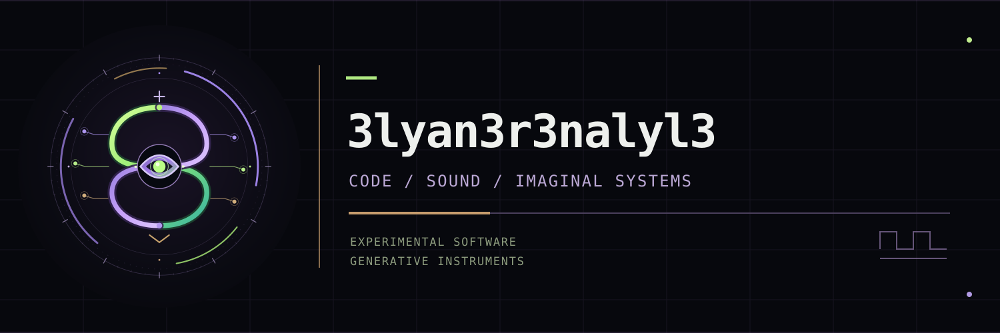

# Welcome to my experimental laboratory

I'm a philosopher, musician, composer, writer and independent researcher exploring the intersections of **sound synthesis, generative computation, consciousness and experimental art**.

My projects investigate unconventional digital instruments, algorithmic composition, sonic mutation and the creative possibilities of human–machine collaboration.

### All my projects

Welcome to my growing laboratory of experimental software, generative sound, and computational imagination.

#### Voudontronics and other experiments

- [Voudontronics](https://github.com/3lyan3r3nalyl3/Voudontronics)
- [Voudontronics-NERVE](https://github.com/3lyan3r3nalyl3/Voudontronics-NERVE)
- [PALIMPSEST](https://github.com/3lyan3r3nalyl3/PALIMPSEST)
- [FOLIO](https://github.com/3lyan3r3nalyl3/FOLIO)
- [Logue-XD-Lab](https://github.com/3lyan3r3nalyl3/Logue-XD-Lab)
- [Project-Moebius-Sound-Breeder](https://github.com/3lyan3r3nalyl3/Project-Moebius-Sound-Breeder)
- [ProjectMoebiusSoundBreeder](https://github.com/3lyan3r3nalyl3/ProjectMoebiusSoundBreeder)
- [project-mobius](https://github.com/3lyan3r3nalyl3/project-mobius)

#### Projects on my second GitHub account

- [Butterflyer](https://github.com/karsikasj-second/Butterflyer)
- [Hymnarium](https://github.com/karsikasj-second/Hymnarium)
- [TheChaoSophisT](https://github.com/karsikasj-second/TheChaoSophisT)

*CODE / SOUND / IMAGINAL SYSTEMS*

(I use the word "imaginal" in the sense of it's use by philosopher Henri Corbin:

Mundus Imaginalis is an “imaginal” world described by Henri Corbin as an intermediary
reality between the natural/sensory world and the spiritual realm, where imaginative
perception gives real, true knowledge. It is contrasted with the “imaginary,” and is
presented as a domain of visionary, symbolic, and prophetic - gnostic - experience.)
